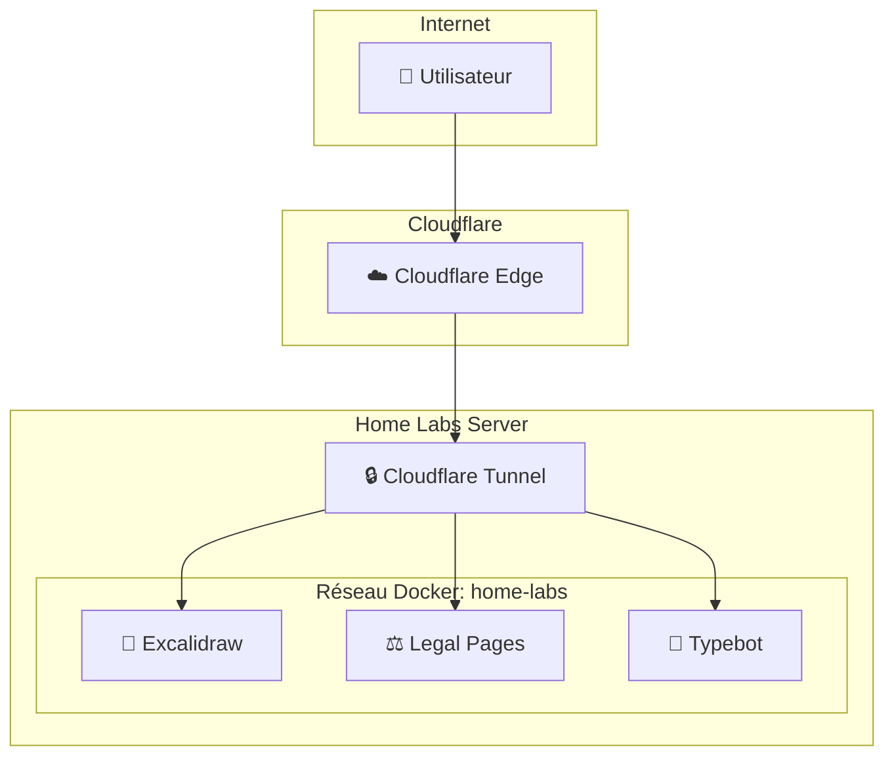

# 🏠 Home Labs

> Infrastructure home lab auto-hébergée avec Docker Compose et Cloudflare Tunnel.

[](LICENSE)
[](https://docs.docker.com/compose/)
[](https://developers.cloudflare.com/cloudflare-one/connections/connect-networks/)

## 📋 Vue d'Ensemble



## 📦 Services

| Service | Description | URL |
|---------|-------------|-----|
| 📝 Excalidraw | Tableau blanc collaboratif | [excalidraw.yanis-harrat.com](https://excalidraw.yanis-harrat.com) |
| ⚖️ Legal Pages | Pages légales RGPD | [legal.yanis-harrat.com](https://legal.yanis-harrat.com) |
| 🤖 Typebot | Plateforme chatbots no-code | [typebot.yanis-harrat.com](https://typebot.yanis-harrat.com) |

## 🚀 Démarrage Rapide

```bash
# 1. Cloner
git clone https://github.com/yanix2445/Home-labs.git
cd Home-labs

# 2. Créer le réseau
docker network create home-labs

# 3. Configurer le gateway
cd infrastructure/gateway
cp .env.example .env
# Éditer .env avec votre CF_TUNNEL_TOKEN

# 4. Démarrer
cd ../..
./scripts/start-all.sh
```

## 📂 Structure

```
home-labs/
├── infrastructure/        # Gateway Cloudflare Tunnel
│   └── gateway/
├── services/             # Services applicatifs
│   ├── 00_legal-pages/   # Pages légales (Next.js)
│   ├── 01_excalidraw/    # Tableau blanc
│   ├── 02_typebot/       # Chatbots
│   └── _template/        # Template de service
├── scripts/              # Utilitaires
│   ├── start-all.sh
│   ├── stop-all.sh
│   └── create-service.sh
└── docs/                 # Documentation complète
```

## 🛠️ Commandes

| Commande | Description |
|----------|-------------|
| `./scripts/start-all.sh` | Démarrer tous les services |
| `./scripts/stop-all.sh` | Arrêter tous les services |
| `./scripts/create-service.sh <nom>` | Créer un nouveau service |

<details>
<summary><strong>Commandes Docker</strong></summary>

```bash
# Logs d'un service
cd services/<service>
docker compose logs -f

# Redémarrer
docker compose restart

# Rebuild
docker compose up -d --build
```

</details>

## ➕ Ajouter un Service

```bash
# Méthode rapide
./scripts/create-service.sh mon-service

# Puis éditer et démarrer
cd services/mon-service
nano docker-compose.yml
docker compose up -d
```

➡️ [Guide complet](docs/adding-services.md)

## 📚 Documentation

| Document | Description |
|----------|-------------|
| [📖 Documentation](docs/README.md) | Index de la documentation |
| [🏗️ Architecture](docs/architecture.md) | Vue technique détaillée |
| [➕ Ajouter un service](docs/adding-services.md) | Guide de création |
| [🔧 Troubleshooting](docs/guides/troubleshooting.md) | Résolution de problèmes |
| [🤖 CLAUDE.md](CLAUDE.md) | Instructions pour agents IA |

## 🔒 Sécurité

- ✅ Aucun port exposé publiquement
- ✅ Tunnel chiffré TLS via Cloudflare
- ✅ Conteneurs avec `no-new-privileges`
- ✅ Limites de ressources (CPU/RAM)
- ✅ Secrets via `.env` (non versionnés)

## 🔗 Liens

| Ressource | URL |
|-----------|-----|
| 🌐 Site Web | [yanis-harrat.com](https://yanis-harrat.com) |
| 📦 GitHub | [yanix2445/Home-labs](https://github.com/yanix2445/Home-labs) |

## 📝 Licence

[MIT](LICENSE) - Voir le fichier LICENSE pour les détails et le disclaimer.

> ⚠️ **Disclaimer** : Ce projet est fourni "TEL QUEL". L'auteur n'est pas responsable des dommages résultant de son utilisation.
