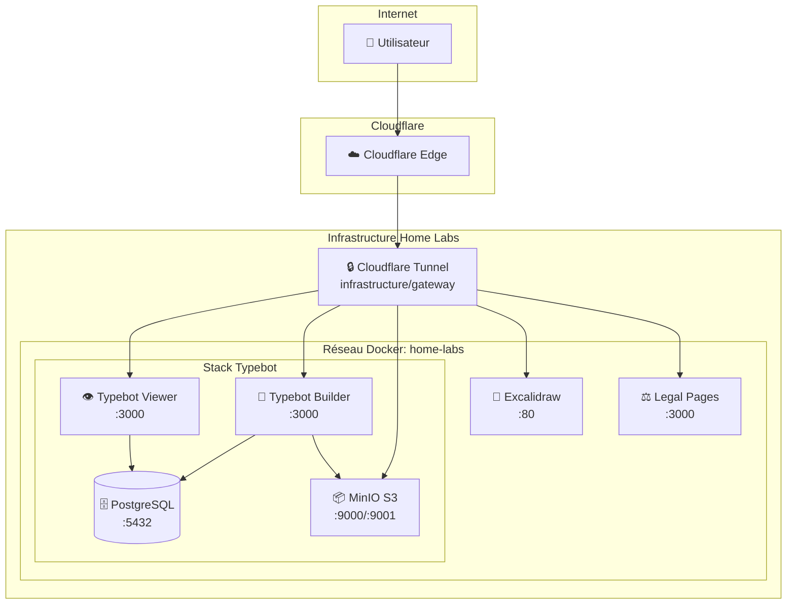

# 📚 Home Labs Documentation

> Documentation complète de l'infrastructure Home Labs — Services auto-hébergés avec Docker Compose et Cloudflare Tunnel.

## 🗺️ Navigation Rapide

| Section | Description |
|---------|-------------|
| [🚀 Quickstart](guides/quickstart.md) | Démarrer en 5 minutes |
| [🏗️ Architecture](architecture.md) | Vue d'ensemble technique |
| [🌐 Infrastructure](infrastructure/gateway.md) | Gateway, réseau, sécurité |
| [📦 Services](services/legal-pages.md) | Catalogue des services |
| [📖 Guides](guides/quickstart.md) | Tutoriels et guides |
| [🔧 Scripts](guides/quickstart.md) | Utilitaires et automation |

---

## 🏗️ Architecture Globale



---

## 📦 Services Disponibles

| Service | Type | URL Publique | Status |
|---------|------|--------------|--------|
| [Excalidraw](services/excalidraw.md) | Image | [excalidraw.yanis-harrat.com](https://excalidraw.yanis-harrat.com) | ✅ Actif |
| [Legal Pages](services/legal-pages.md) | Built | [legal.yanis-harrat.com](https://legal.yanis-harrat.com) | ✅ Actif |
| [Typebot Builder](services/typebot.md) | Stack | [typebot.yanis-harrat.com](https://typebot.yanis-harrat.com) | ✅ Actif |
| [Typebot Viewer](services/typebot.md) | Stack | [bot.yanis-harrat.com](https://bot.yanis-harrat.com) | ✅ Actif |
| [MinIO Console](services/typebot.md#minio) | Stack | [s3.yanis-harrat.com](https://s3.yanis-harrat.com) | ✅ Actif |

---

## 🚀 Démarrage Rapide

```bash
# 1. Cloner le dépôt
git clone https://github.com/yanix2445/Home-labs.git
cd Home-labs

# 2. Créer le réseau Docker
docker network create home-labs

# 3. Configurer le gateway
cd infrastructure/gateway
cp .env.example .env
# Éditer .env avec votre CF_TUNNEL_TOKEN

# 4. Démarrer tous les services
cd ../..
./scripts/start-all.sh
```

> **Tip**: Pour un guide détaillé, consultez [Quickstart](guides/quickstart.md).

---

## 📂 Structure du Projet

```
home-labs/
├── 📁 infrastructure/          # Infrastructure de base
│   └── gateway/               # Cloudflare Tunnel
├── 📁 services/               # Services applicatifs
│   ├── 00_legal-pages/       # Pages légales (Next.js)
│   ├── 01_excalidraw/        # Tableau blanc
│   ├── 02_typebot/           # Plateforme chatbots
│   └── _template/            # Template de service
├── 📁 scripts/                # Scripts utilitaires
│   ├── create-service.sh     # Créer un service
│   ├── start-all.sh          # Démarrer tout
│   └── stop-all.sh           # Arrêter tout
└── 📁 docs/                   # Cette documentation
```

---

## 📖 Guides Disponibles

<details>
<summary><strong>🚀 Démarrage et Installation</strong></summary>

- [Quickstart](guides/quickstart.md) — Démarrer en 5 minutes
- [Déploiement](guides/deployment.md) — Guide de production

</details>

<details>
<summary><strong>📦 Gestion des Services</strong></summary>

- [Ajouter un service](adding-services.md) — Créer un nouveau service
- [Excalidraw](services/excalidraw.md), [Legal Pages](services/legal-pages.md), [Typebot](services/typebot.md)

</details>

<details>
<summary><strong>🔧 Maintenance</strong></summary>

- [Troubleshooting](guides/troubleshooting.md) — Résoudre les problèmes
- [Sécurité](infrastructure/security.md) — Best practices

</details>

<details>
<summary><strong>🤝 Contribution</strong></summary>

- [Guide de contribution](guides/contributing.md) — Comment contribuer

</details>

---

## 🔗 Liens Utiles

| Ressource | Lien |
|-----------|------|
| 🏠 Site Web | [yanis-harrat.com](https://yanis-harrat.com) |
| 📦 GitHub | [yanix2445/Home-labs](https://github.com/yanix2445/Home-labs) |
| 📄 Licence | [MIT](../LICENSE) |

---

<div align="center">

**[⬆️ Retour en haut](#-home-labs-documentation)**

</div>
