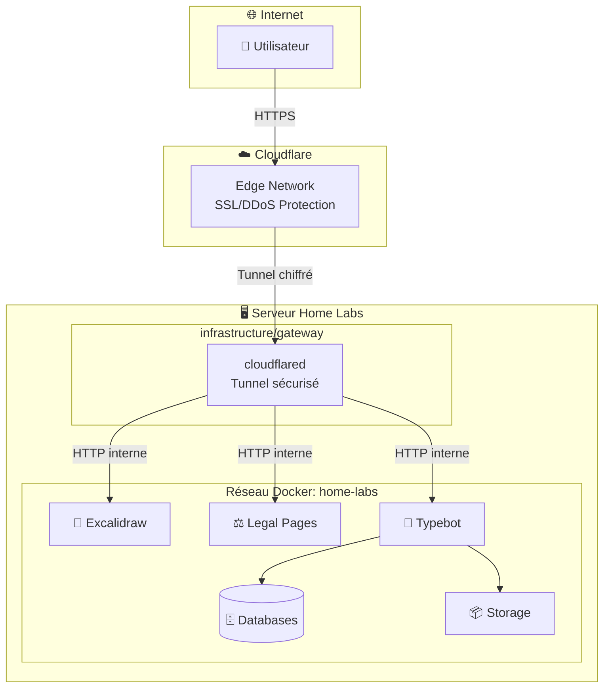
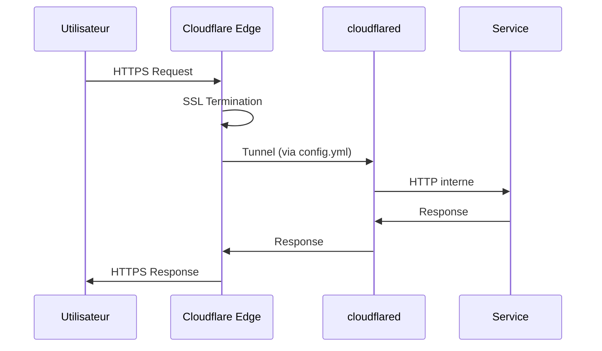
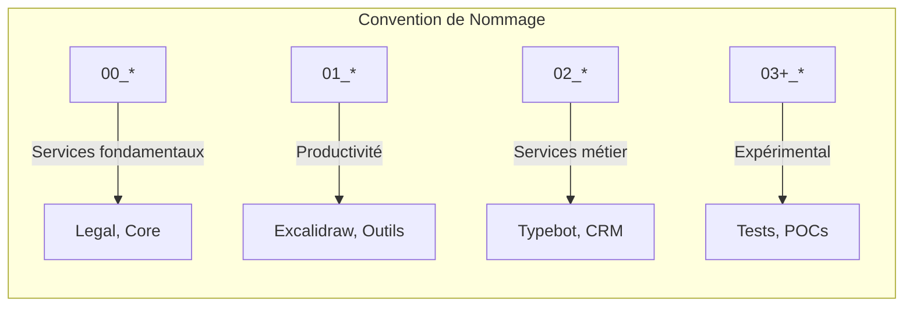
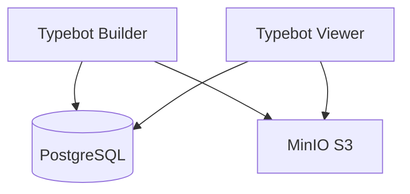
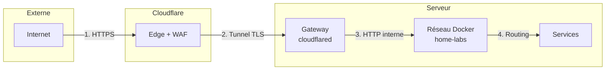
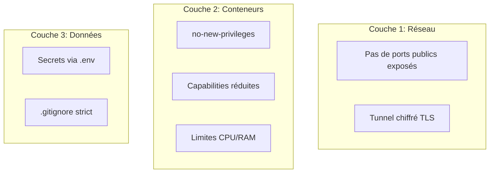

# 🏗️ Architecture

> Vue d'ensemble technique de l'infrastructure Home Labs.

## Vue d'Ensemble

L'infrastructure Home Labs repose sur Docker Compose avec une architecture réseau partagée et un accès sécurisé via Cloudflare Tunnel.



---

## Composants Principaux

### 🔒 Infrastructure (`infrastructure/`)

L'infrastructure comprend les composants de base nécessaires au fonctionnement de tous les services.

| Composant | Rôle | Documentation |
|-----------|------|---------------|
| **Gateway** | Expose les services via Cloudflare Tunnel | [gateway.md](infrastructure/gateway.md) |
| **Network** | Réseau Docker partagé `home-labs` | [network.md](infrastructure/network.md) |

#### Gateway Cloudflare Tunnel



- **Technologie** : `cloudflared` (image officielle Cloudflare)
- **Configuration** : `config.yml` définit les règles d'ingress
- **Authentification** : Token de tunnel via variable d'environnement
- **Documentation** : [infrastructure/gateway.md](infrastructure/gateway.md)

#### Réseau Docker

- **Nom** : `home-labs` (réseau externe)
- **Type** : Bridge network
- **Usage** : Communication inter-conteneurs par nom de service
- **Création** : `docker network create home-labs`

---

### 📦 Services (`services/`)

Les services applicatifs sont organisés avec des préfixes numériques indiquant leur priorité.



| Préfixe | Catégorie | Exemples |
|---------|-----------|----------|
| `00_` | Services fondamentaux | Legal pages, infrastructure critique |
| `01_` | Productivité et collaboration | Excalidraw, outils de travail |
| `02_` | Services métier | Typebot, communication, CRM |
| `03+` | Expérimental | Tests, prototypes |

#### Types de Services

<details>
<summary><strong>1. Services image-based (Simple)</strong></summary>

Utilisent une image Docker pré-construite sans build requis.

**Exemple** : `01_excalidraw/`

```yaml
services:
  excalidraw:
    image: excalidraw/excalidraw:latest
    container_name: excalidraw
    networks:
      - home-labs
```

**Idéal pour** : Outils tiers, services standard

</details>

<details>
<summary><strong>2. Services construits (Built)</strong></summary>

Applications custom avec Dockerfile et build local.

**Exemple** : `00_legal-pages/`

```
services/00_legal-pages/
├── docker-compose.yml    # Avec section build:
├── legal-app/           # Application Next.js
│   ├── Dockerfile       # Multi-stage build
│   ├── app/            # Code source
│   └── package.json
└── .env                 # Variables
```

**Idéal pour** : Applications Next.js, React, custom

</details>

<details>
<summary><strong>3. Stacks multi-conteneurs (Orchestrated)</strong></summary>

Plusieurs conteneurs interdépendants avec health checks.

**Exemple** : `02_typebot/`



**Idéal pour** : Stacks complètes (app + DB + storage)

</details>

---

## 🔄 Flux de Trafic



| Étape | Description |
|-------|-------------|
| 1 | L'utilisateur accède via HTTPS (SSL géré par Cloudflare) |
| 2 | Cloudflare route vers le tunnel chiffré |
| 3 | `cloudflared` transmet au réseau Docker local |
| 4 | Le service répond via le même chemin |

---

## 🛡️ Sécurité

L'infrastructure implémente plusieurs couches de sécurité :



| Mesure | Description |
|--------|-------------|
| **Isolation réseau** | Réseau Docker dédié, pas d'exposition directe |
| **Tunnel chiffré** | TLS bout-en-bout via Cloudflare |
| **Limites de ressources** | CPU et RAM limitées par conteneur |
| **Sécurité runtime** | `no-new-privileges`, capabilities minimales |
| **Gestion des secrets** | Variables d'environnement, jamais committées |

> **Important**: Consultez le guide complet de sécurité : [infrastructure/security.md](infrastructure/security.md)

---

## 📈 Scalabilité

L'architecture permet une scalabilité horizontale simple :

- **Ajout de services** : Copier template → Configurer → Ajouter au gateway
- **Séparation claire** : Infrastructure / Services / Scripts
- **Pas de limite** : Le nombre de services n'est limité que par les ressources serveur

```bash
# Ajouter un nouveau service en 3 commandes
./scripts/create-service.sh mon-service
# Éditer la configuration...
docker compose up -d
```

> **Note**: Guide complet : [adding-services.md](adding-services.md)

---

## 📚 Documentation Liée

- [Guide d'ajout de services](adding-services.md)
- [Infrastructure Gateway](infrastructure/gateway.md)
- [Infrastructure Réseau](infrastructure/network.md)
- [Best Practices Sécurité](infrastructure/security.md)

---

<div align="center">

**[⬅️ Retour à l'index](README.md)**

</div>
