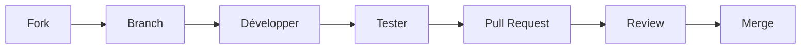

# 🤝 Contribution

> Comment contribuer au projet Home Labs.

## Workflow



---

## Ajouter un Service

1. **Créer le service**
```bash
./scripts/create-service.sh mon-service
```

2. **Configurer** `docker-compose.yml`

3. **Documenter** dans `docs/services/mon-service.md`

4. **Ajouter au gateway** si accès externe requis

5. **Tester** localement

---

## Conventions

### Nommage des Services

| Préfixe | Usage |
|---------|-------|
| `00_` | Services fondamentaux |
| `01_` | Productivité |
| `02_` | Services métier |
| `03+` | Expérimental |

### Docker Compose

```yaml
# Obligatoire
networks:
  - home-labs

# Recommandé
security_opt:
  - no-new-privileges:true
deploy:
  resources:
    limits:
      memory: 512M
```

### Documentation

- Utiliser le français
- Inclure des exemples de code
- Ajouter des diagrammes mermaid si utile

---

## Structure des Commits

```
type(scope): description

[body optionnel]
```

**Types :**
- `feat` : Nouvelle fonctionnalité
- `fix` : Correction de bug
- `docs` : Documentation
- `chore` : Maintenance

**Exemples :**
```
feat(services): add vaultwarden service
docs(typebot): add oauth configuration guide
fix(gateway): correct port mapping for minio
```

---

## Checklist PR

- [ ] Service fonctionne localement
- [ ] Documentation ajoutée
- [ ] Pas de secrets dans le code
- [ ] `.env.example` fourni si nécessaire
- [ ] Gateway config mis à jour si requis

---

<div align="center">

**[⬅️ Retour à l'index](../README.md)**

</div>
