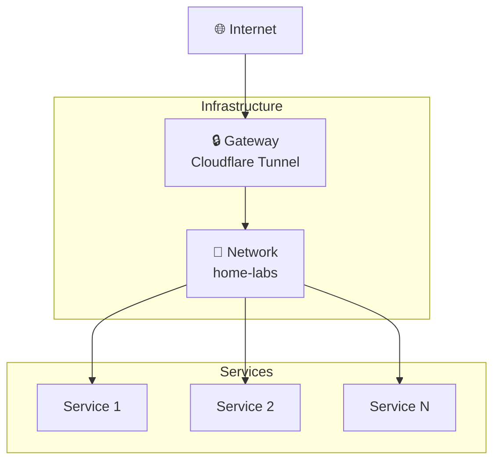

# 🌐 Infrastructure

> Documentation de l'infrastructure de base Home Labs.

## Composants

L'infrastructure comprend les éléments essentiels au fonctionnement des services :

| Composant | Description | Documentation |
|-----------|-------------|---------------|
| 🔒 **Gateway** | Cloudflare Tunnel pour l'accès externe | [gateway.md](gateway.md) |
| 🔗 **Network** | Réseau Docker partagé | [network.md](network.md) |
| 🛡️ **Security** | Best practices de sécurité | [security.md](security.md) |

---

## Architecture



---

## Fichiers Clés

| Fichier | Emplacement | Description |
|---------|-------------|-------------|
| `docker-compose.yml` | `infrastructure/gateway/` | Définition du tunnel |
| `config.yml` | `infrastructure/gateway/` | Règles de routage |
| `.env` | `infrastructure/gateway/` | Token de tunnel (secret) |

---

## Démarrage

```bash
# Créer le réseau (une seule fois)
docker network create home-labs

# Démarrer le gateway
cd infrastructure/gateway
cp .env.example .env
# Éditer .env avec votre CF_TUNNEL_TOKEN
docker compose up -d
```

---

## Documentation Détaillée

- [Configuration du Gateway](gateway.md)
- [Réseau Docker](network.md)
- [Best Practices Sécurité](security.md)

---

<div align="center">

**[⬅️ Retour à l'index](../README.md)**

</div>
