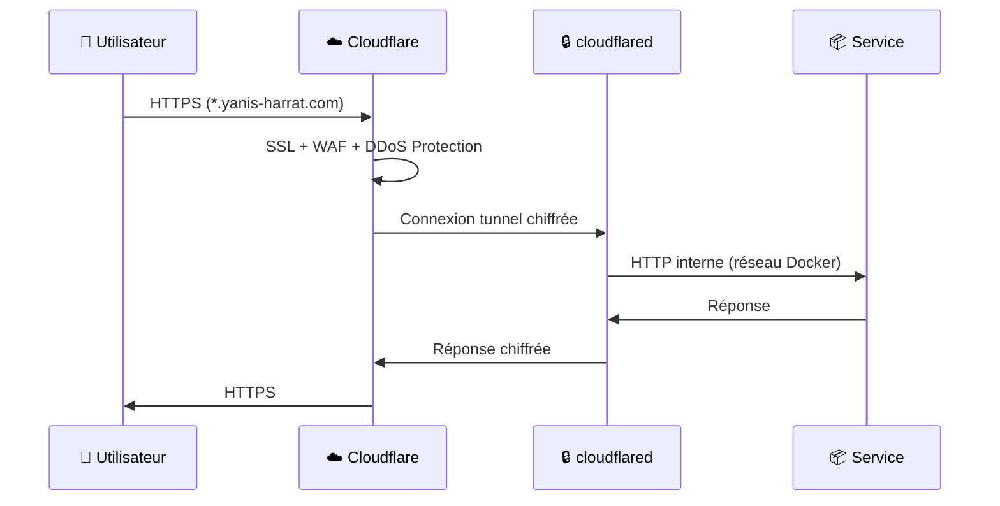

# 🔒 Gateway (Cloudflare Tunnel)

> Configuration et gestion du Cloudflare Tunnel pour exposer les services à internet.

## Vue d'Ensemble

Le gateway utilise `cloudflared` pour créer un tunnel sécurisé entre vos services et Cloudflare, sans exposer de ports publics.



---

## Configuration

### Fichiers

| Fichier | Description |
|---------|-------------|
| `docker-compose.yml` | Définition du conteneur cloudflared |
| `config.yml` | Règles de routage ingress |
| `.env` | Token de tunnel (secret) |
| `.env.example` | Template pour `.env` |

### Structure

```
infrastructure/gateway/
├── docker-compose.yml
├── config.yml
├── .env              # Non versionné (secret)
└── .env.example      # Template
```

---

## Installation

### 1. Obtenir un Token de Tunnel

1. Connectez-vous au [dashboard Cloudflare](https://one.dash.cloudflare.com/)
2. Allez dans **Zero Trust** → **Networks** → **Tunnels**
3. Créez un nouveau tunnel ou utilisez un existant
4. Copiez le token du tunnel

### 2. Configurer l'environnement

```bash
cd infrastructure/gateway
cp .env.example .env
```

Éditez `.env` :
```env
CF_TUNNEL_TOKEN=eyJhIjoixxxxxxxxxxxxxxxxxxxxxxxxxxxxxxxx...
```

### 3. Démarrer le Gateway

```bash
docker compose up -d
```

---

## Configuration du Routage

Le fichier `config.yml` définit les règles de routage :

```yaml
ingress:
  # Format: hostname externe → service interne
  - hostname: excalidraw.yanis-harrat.com
    service: http://excalidraw:80

  - hostname: typebot.yanis-harrat.com
    service: http://typebot-builder:3000

  - hostname: bot.yanis-harrat.com
    service: http://typebot-viewer:3000

  - hostname: legal.yanis-harrat.com
    service: http://legal-pages:3000

  # Route par défaut (obligatoire)
  - service: http_status:404
```

### Syntaxe

```yaml
- hostname: <sous-domaine>.<domaine>
  service: http://<nom_conteneur>:<port_interne>
```

> **Important**: Le `nom_conteneur` doit correspondre au `container_name` dans le docker-compose du service.

### Options Avancées

Pour les services nécessitant une configuration spéciale :

```yaml
- hostname: storage.yanis-harrat.com
  service: http://typebot-minio:9000
  originRequest:
    noTLSVerify: true
    connectTimeout: 60s
    tcpKeepAlive: 30s
    keepAliveTimeout: 90s
    disableChunkedEncoding: true
```

---

## Ajouter un Nouveau Service

1. **Éditer** `config.yml` :
```yaml
ingress:
  # ... règles existantes ...
  
  - hostname: mon-service.yanis-harrat.com
    service: http://mon-service:80
```

2. **Redémarrer** le gateway :
```bash
docker compose restart
```

3. **Vérifier** que le service est accessible via l'URL publique.

---

## Commandes Utiles

```bash
# Voir les logs du tunnel
docker compose logs -f

# Vérifier le statut
docker compose ps

# Redémarrer après modification de config.yml
docker compose restart

# Recréer après modification de .env
docker compose up -d --force-recreate
```

---

## docker-compose.yml

```yaml
name: home-labs-gateway

services:
  cloudflared:
    image: cloudflare/cloudflared:latest
    container_name: home-labs-cloudflared
    restart: unless-stopped
    command: tunnel --config /etc/cloudflared/config.yml run
    
    volumes:
      - ./config.yml:/etc/cloudflared/config.yml:ro
    
    environment:
      - TUNNEL_TOKEN=${CF_TUNNEL_TOKEN}
    
    networks:
      - home-labs
    
    # Sécurité renforcée
    security_opt:
      - no-new-privileges:true
    cap_drop:
      - ALL
    read_only: true

networks:
  home-labs:
    external: true
```

---

## Troubleshooting

<details>
<summary><strong>❌ Le tunnel ne démarre pas</strong></summary>

**Vérifications :**
1. Le token est-il correct ? Vérifiez `.env`
2. Le réseau existe-t-il ? `docker network inspect home-labs`

**Logs :**
```bash
docker compose logs -f
```

</details>

<details>
<summary><strong>❌ Service inaccessible</strong></summary>

**Vérifications :**
1. Le service est-il sur le réseau `home-labs` ?
```bash
docker network inspect home-labs | grep <nom_service>
```

2. La règle d'ingress est-elle correcte dans `config.yml` ?

3. Le gateway a-t-il été redémarré ?
```bash
docker compose restart
```

</details>

<details>
<summary><strong>❌ Erreur 502 Bad Gateway</strong></summary>

Le service cible ne répond pas. Vérifiez :
1. Le service est-il démarré ? `docker ps | grep <service>`
2. Le port interne est-il correct ?
3. Le nom de conteneur correspond-il à celui dans `config.yml` ?

</details>

---

## Sécurité

Le gateway implémente plusieurs mesures de sécurité :

| Mesure | Description |
|--------|-------------|
| `no-new-privileges` | Empêche l'escalade de privilèges |
| `cap_drop: ALL` | Supprime toutes les capabilities |
| `read_only: true` | Système de fichiers en lecture seule |
| Token via `.env` | Secret non versionné |

---

## Liens Utiles

- [Documentation Cloudflare Tunnel](https://developers.cloudflare.com/cloudflare-one/connections/connect-networks/)
- [Dashboard Zero Trust](https://one.dash.cloudflare.com/)

---

<div align="center">

**[⬅️ Retour à Infrastructure](README.md)** · **[🏠 Index](../README.md)**

</div>
