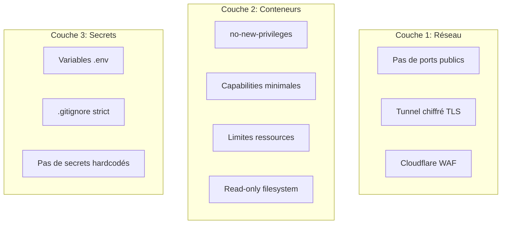

# 🛡️ Best Practices Sécurité

> Guide des bonnes pratiques de sécurité pour l'infrastructure Home Labs.

## Vue d'Ensemble

L'infrastructure implémente une approche de sécurité en profondeur :



---

## 🔒 Sécurité Réseau

### Pas d'Exposition Directe

Les services ne doivent **jamais** exposer de ports publics :

```yaml
# ❌ MAUVAIS - Port exposé publiquement
services:
  mon-service:
    ports:
      - "8080:80"

# ✅ BON - Accès via gateway uniquement
services:
  mon-service:
    networks:
      - home-labs
    # Pas de section "ports"
```

### Tunnel Chiffré

Tout le trafic externe passe par Cloudflare Tunnel avec TLS bout-en-bout.

| Segment | Chiffrement |
|---------|-------------|
| Utilisateur → Cloudflare | HTTPS (TLS 1.3) |
| Cloudflare → Tunnel | Tunnel chiffré |
| Tunnel → Service | HTTP interne (réseau privé) |

---

## 🐳 Sécurité des Conteneurs

### Configuration Minimale Recommandée

```yaml
services:
  mon-service:
    # Empêcher l'escalade de privilèges
    security_opt:
      - no-new-privileges:true
    
    # Supprimer toutes les capabilities
    cap_drop:
      - ALL
    
    # Limiter les ressources
    deploy:
      resources:
        limits:
          cpus: '0.50'
          memory: 512M
```

### Configuration Avancée

Pour les services critiques (comme le gateway) :

```yaml
services:
  mon-service:
    security_opt:
      - no-new-privileges:true
    
    cap_drop:
      - ALL
    
    # Système de fichiers en lecture seule
    read_only: true
    
    # tmpfs pour les écritures temporaires
    tmpfs:
      - /tmp:rw,noexec,nosuid,size=128m
    
    # Limites strictes
    deploy:
      resources:
        limits:
          cpus: '0.25'
          memory: 256M
        reservations:
          cpus: '0.1'
          memory: 128M
```

### Capabilities

| Capability | Usage | Quand l'ajouter |
|------------|-------|-----------------|
| `CHOWN` | Changer propriétaire fichiers | Services avec volumes persistants |
| `SETUID/SETGID` | Changer utilisateur | Services nécessitant drop de privilèges |
| `NET_BIND_SERVICE` | Binder ports < 1024 | Services sur port 80/443 |

```yaml
# Si nécessaire, ajouter seulement ce qui est requis
cap_add:
  - CHOWN
  - SETUID
  - SETGID
```

---

## 🔑 Gestion des Secrets

### Règles Fondamentales

1. **Jamais** de secrets dans le code
2. **Toujours** utiliser des variables d'environnement
3. **Toujours** exclure `.env` du versioning

### Structure des Fichiers

```
service/
├── .env              # ⛔ Secret - jamais commité
├── .env.example      # ✅ Template sans valeurs
└── docker-compose.yml
```

### Template .env.example

```env
# Configuration API (obtenir sur https://...)
API_KEY=your_api_key_here
API_SECRET=your_api_secret_here

# Base de données
DB_PASSWORD=generate_strong_password

# Tokens
ADMIN_TOKEN=generate_with_openssl_rand
```

### Générer des Secrets

```bash
# Générer un secret aléatoire (base64)
openssl rand -base64 32

# Générer un mot de passe
openssl rand -hex 16

# Générer un token JWT-compatible
openssl rand -base64 48 | tr -d '=/+'
```

---

## 📝 .gitignore

Le `.gitignore` du projet exclut tous les fichiers sensibles :

```gitignore
# Environnement
.env
.env.local
.env.*.local

# Données
**/data/
**/volumes/

# Logs
*.log

# Secrets
*.key
*.pem
*.crt
```

---

## 🔍 Audit de Sécurité

### Checklist par Service

Pour chaque nouveau service, vérifiez :

- [ ] Pas de ports exposés (`ports:`)
- [ ] `security_opt: no-new-privileges:true`
- [ ] `cap_drop: ALL`
- [ ] Limites de ressources définies
- [ ] `.env` dans `.gitignore`
- [ ] `.env.example` fourni
- [ ] Pas de secrets hardcodés

### Commandes de Vérification

```bash
# Vérifier les ports exposés
docker ps --format "{{.Names}}: {{.Ports}}"

# Vérifier les capabilities d'un conteneur
docker inspect <container> --format '{{.HostConfig.CapDrop}}'

# Vérifier les limites mémoire
docker stats --no-stream

# Vérifier les fichiers sensibles non exclus
git status --ignored
```

---

## 🚨 Alertes de Sécurité

### Images Docker

Utilisez des images de confiance et maintenez-les à jour :

```bash
# Mettre à jour les images
docker compose pull

# Redémarrer avec nouvelles images
docker compose up -d
```

### Scan de Vulnérabilités

```bash
# Scanner une image avec Docker Scout
docker scout cves <image>

# Ou avec Trivy
trivy image <image>
```

---

## 📊 Récapitulatif

| Mesure | Priorité | Implémentation |
|--------|----------|----------------|
| Pas de ports exposés | 🔴 Critique | `networks` sans `ports` |
| no-new-privileges | 🔴 Critique | `security_opt` |
| Secrets via .env | 🔴 Critique | `.env` + `.gitignore` |
| cap_drop: ALL | 🟠 Important | `cap_drop` |
| Limites ressources | 🟠 Important | `deploy.resources` |
| Read-only filesystem | 🟡 Recommandé | `read_only: true` |
| Images à jour | 🟡 Recommandé | `docker compose pull` |

---

<div align="center">

**[⬅️ Retour à Infrastructure](README.md)** · **[🏠 Index](../README.md)**

</div>
