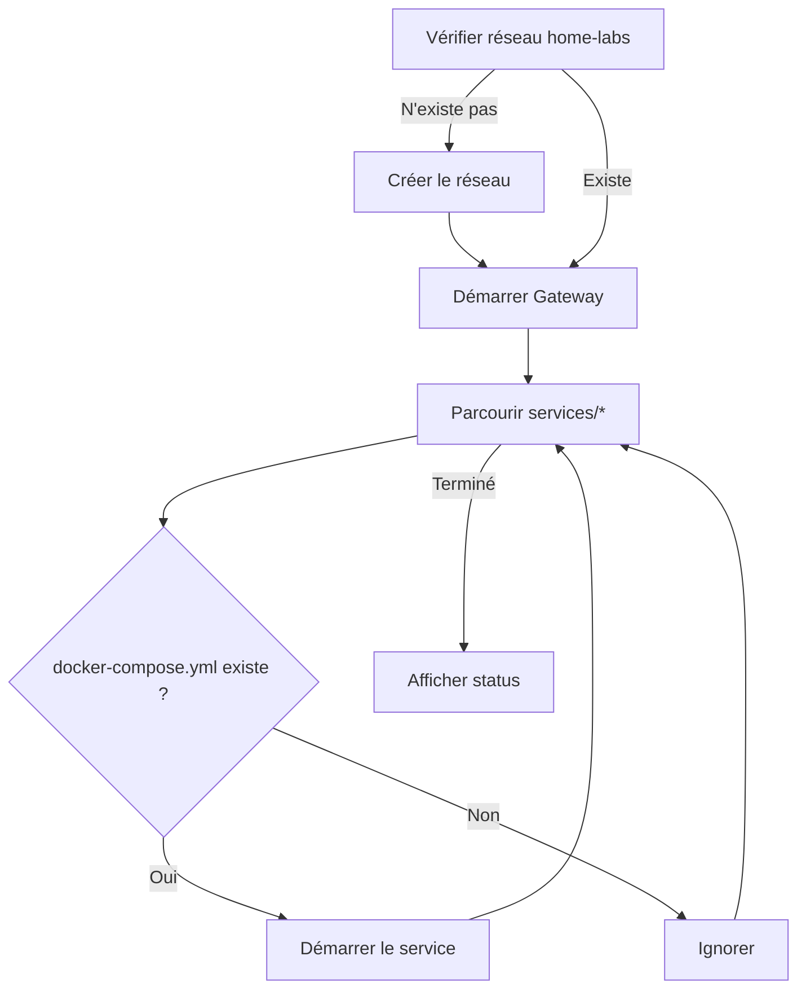
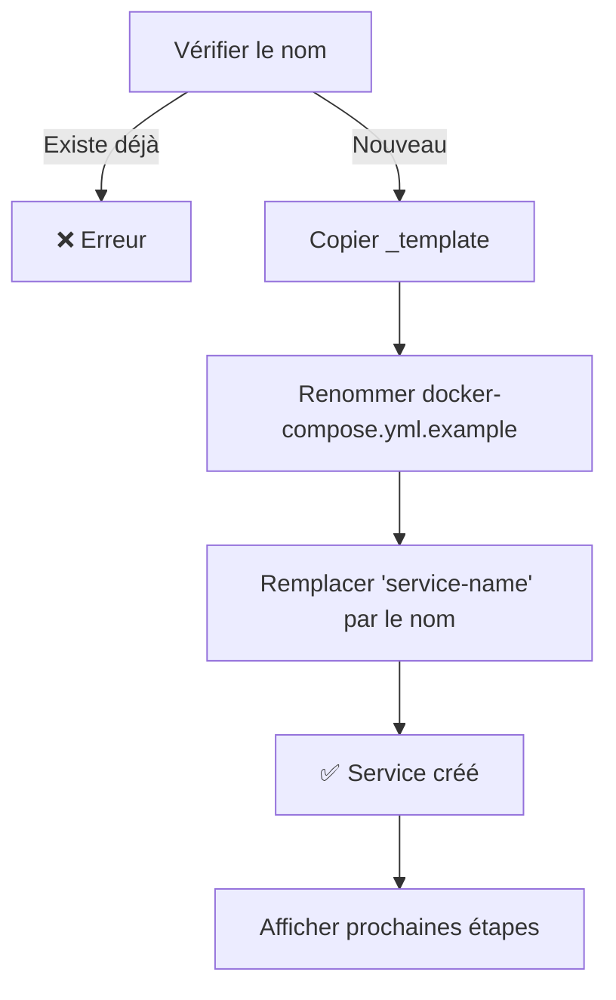

# 🔧 Scripts

> Documentation des scripts utilitaires disponibles.

## Vue d'Ensemble

| Script | Description | Usage |
|--------|-------------|-------|
| [`start-all.sh`](#start-allsh) | Démarre tous les services | `./scripts/start-all.sh` |
| [`stop-all.sh`](#stop-allsh) | Arrête tous les services | `./scripts/stop-all.sh` |
| [`create-service.sh`](#create-servicesh) | Crée un nouveau service | `./scripts/create-service.sh <nom>` |

---

## start-all.sh

Démarre l'infrastructure complète dans l'ordre correct.

### Usage

```bash
./scripts/start-all.sh
```

### Fonctionnement



### Ordre de Démarrage

1. Réseau `home-labs` (création si nécessaire)
2. Gateway (`infrastructure/gateway`)
3. Services (`services/*` sauf `_template`)

### Sortie

```
🚀 Démarrage de l'infrastructure Home Labs...
📡 Création du réseau home-labs...
🔒 Démarrage du gateway Cloudflare...
📦 Démarrage des services...
  ▶️  Démarrage de 00_legal-pages...
  ▶️  Démarrage de 01_excalidraw...
  ▶️  Démarrage de 02_typebot...
✅ Tous les services sont démarrés !

📊 Status :
NAMES                  STATUS       PORTS
home-labs-cloudflared  Up 5 seconds
excalidraw             Up 3 seconds
...
```

---

## stop-all.sh

Arrête tous les services et l'infrastructure.

### Usage

```bash
./scripts/stop-all.sh
```

### Ordre d'Arrêt

1. Services (`services/*`)
2. Gateway (`infrastructure/gateway`)

> **Note**: L'ordre inverse du démarrage garantit une fermeture propre.

---

## create-service.sh

Crée un nouveau service à partir du template.

### Usage

```bash
./scripts/create-service.sh <nom-du-service>
```

### Exemple

```bash
./scripts/create-service.sh vaultwarden
```

### Fonctionnement



### Sortie

```
📦 Création du service 'vaultwarden'...
✅ Service 'vaultwarden' créé dans services/vaultwarden

📝 Prochaines étapes :
  1. Éditez services/vaultwarden/docker-compose.yml
  2. Ajoutez une règle dans infrastructure/gateway/config.yml (si accès externe)
  3. Démarrez le service : cd services/vaultwarden && docker compose up -d
```

---

## Code Source

<details>
<summary><strong>start-all.sh</strong></summary>

```bash
#!/bin/bash
set -e

echo "🚀 Démarrage de l'infrastructure Home Labs..."

# Vérifier/créer le réseau
if ! docker network inspect home-labs &>/dev/null; then
    echo "📡 Création du réseau home-labs..."
    docker network create home-labs
fi

# Démarrer le gateway
echo "🔒 Démarrage du gateway Cloudflare..."
cd infrastructure/gateway
docker compose up -d
cd ../..

# Démarrer les services
echo "📦 Démarrage des services..."
for service in services/*/; do
    if [ -f "$service/docker-compose.yml" ]; then
        service_name=$(basename "$service")
        if [ "$service_name" != "_template" ]; then
            echo "  ▶️  Démarrage de $service_name..."
            cd "$service"
            docker compose up -d
            cd ../..
        fi
    fi
done

echo "✅ Tous les services sont démarrés !"
docker ps --filter "network=home-labs" --format "table {{.Names}}\t{{.Status}}"
```

</details>

<details>
<summary><strong>stop-all.sh</strong></summary>

```bash
#!/bin/bash
set -e

echo "🛑 Arrêt de l'infrastructure Home Labs..."

# Arrêter les services
echo "📦 Arrêt des services..."
for service in services/*/; do
    if [ -f "$service/docker-compose.yml" ]; then
        service_name=$(basename "$service")
        if [ "$service_name" != "_template" ]; then
            echo "  ⏹️  Arrêt de $service_name..."
            cd "$service"
            docker compose down
            cd ../..
        fi
    fi
done

# Arrêter le gateway
echo "🔒 Arrêt du gateway Cloudflare..."
cd infrastructure/gateway
docker compose down
cd ../..

echo "✅ Tous les services sont arrêtés !"
```

</details>

<details>
<summary><strong>create-service.sh</strong></summary>

```bash
#!/bin/bash
set -e

if [ $# -ne 1 ]; then
    echo "Usage: $0 <nom-du-service>"
    exit 1
fi

SERVICE_NAME=$1
SERVICE_DIR="services/$SERVICE_NAME"

if [ -d "$SERVICE_DIR" ]; then
    echo "❌ Le service '$SERVICE_NAME' existe déjà !"
    exit 1
fi

echo "📦 Création du service '$SERVICE_NAME'..."

cp -r services/_template "$SERVICE_DIR"
mv "$SERVICE_DIR/docker-compose.yml.example" "$SERVICE_DIR/docker-compose.yml"
sed -i '' "s/service-name/$SERVICE_NAME/g" "$SERVICE_DIR/docker-compose.yml"

echo "✅ Service '$SERVICE_NAME' créé dans $SERVICE_DIR"
echo ""
echo "📝 Prochaines étapes :"
echo "  1. Éditez $SERVICE_DIR/docker-compose.yml"
echo "  2. Ajoutez une règle dans infrastructure/gateway/config.yml"
echo "  3. Démarrez le service : cd $SERVICE_DIR && docker compose up -d"
```

</details>

---

<div align="center">

**[⬅️ Retour à l'index](../README.md)**

</div>
