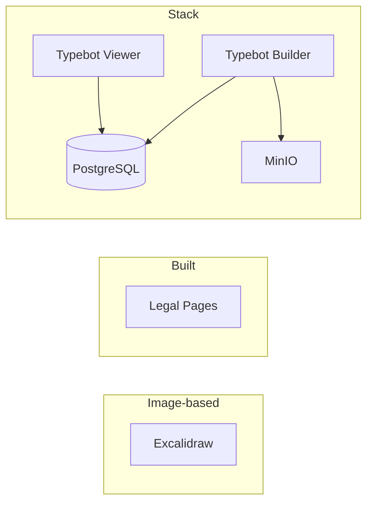

# 📦 Services

> Catalogue des services déployés dans l'infrastructure Home Labs.

## Vue d'Ensemble

| Service | Type | Description | URL | Status |
|---------|------|-------------|-----|--------|
| [Legal Pages](legal-pages.md) | Built | Pages légales RGPD | [legal.yanis-harrat.com](https://legal.yanis-harrat.com) | ✅ |
| [Excalidraw](excalidraw.md) | Image | Tableau blanc collaboratif | [excalidraw.yanis-harrat.com](https://excalidraw.yanis-harrat.com) | ✅ |
| [Typebot](typebot.md) | Stack | Plateforme de chatbots | [typebot.yanis-harrat.com](https://typebot.yanis-harrat.com) | ✅ |

---

## Types de Services



| Type | Description | Exemple |
|------|-------------|---------|
| **Image-based** | Image Docker pré-construite | Excalidraw |
| **Built** | Application custom avec Dockerfile | Legal Pages |
| **Stack** | Plusieurs conteneurs orchestrés | Typebot |

---

## Services Détaillés

### 📝 Excalidraw

**Tableau blanc collaboratif open-source**

- **URL** : [excalidraw.yanis-harrat.com](https://excalidraw.yanis-harrat.com)
- **Type** : Image-based
- **Image** : `excalidraw/excalidraw:latest`
- [Documentation complète](excalidraw.md)

### ⚖️ Legal Pages

**Pages légales avec formulaires RGPD**

- **URL** : [legal.yanis-harrat.com](https://legal.yanis-harrat.com)
- **Type** : Built (Next.js 16)
- **Stack** : Next.js + React 19 + Tailwind + Resend
- [Documentation complète](legal-pages.md)

### 🤖 Typebot

**Plateforme de création de chatbots no-code**

- **Builder** : [typebot.yanis-harrat.com](https://typebot.yanis-harrat.com)
- **Viewer** : [bot.yanis-harrat.com](https://bot.yanis-harrat.com)
- **Type** : Stack multi-conteneurs
- [Documentation complète](typebot.md)

---

## Gestion des Services

### Démarrer Tous les Services

```bash
./scripts/start-all.sh
```

### Démarrer un Service Spécifique

```bash
cd services/<nom-service>
docker compose up -d
```

### Voir les Logs

```bash
cd services/<nom-service>
docker compose logs -f
```

### Arrêter un Service

```bash
cd services/<nom-service>
docker compose down
```

---

## Ajouter un Nouveau Service

Pour ajouter un nouveau service, consultez le guide :

➡️ [Ajouter un service](../adding-services.md)

---

<div align="center">

**[⬅️ Retour à l'index](../README.md)**

</div>
