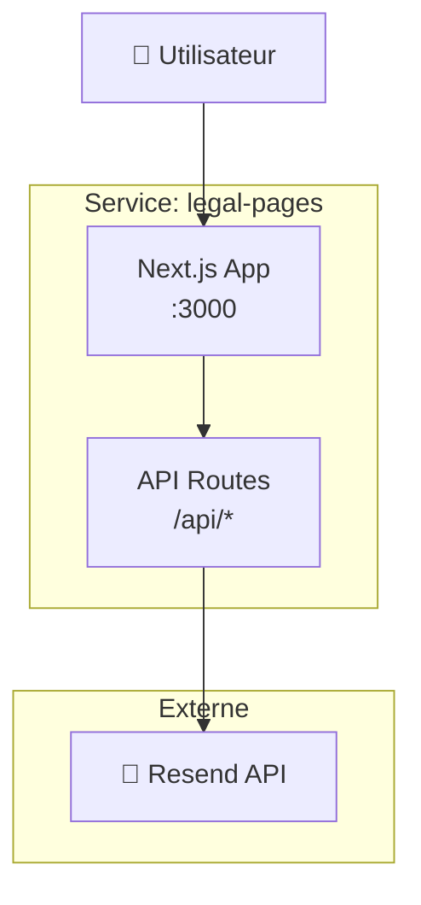

# ⚖️ Legal Pages

> Pages légales avec formulaires de contact, réclamation et suppression RGPD.

## Vue d'Ensemble

| Propriété | Valeur |
|-----------|--------|
| **URL** | [legal.yanis-harrat.com](https://legal.yanis-harrat.com) |
| **Type** | Built (Next.js) |
| **Stack** | Next.js 16 + React 19 + Tailwind 4 + shadcn/ui |
| **Emplacement** | `services/00_legal-pages/` |

---

## 📋 Pages Disponibles

| Route | Description |
|-------|-------------|
| `/` | Accueil |
| `/privacy` | Politique de confidentialité |
| `/terms` | Conditions de service |
| `/cookies` | Politique des cookies |
| `/deletion` | Suppression de données (RGPD) |
| `/contact` | Formulaire de contact |
| `/complaint` | Réclamation |

---

## 🏗️ Architecture



---

## 📂 Structure

```
services/00_legal-pages/
├── docker-compose.yml      # Configuration Docker
├── .env                    # Variables (secret)
├── .env.example           # Template
└── legal-app/             # Application Next.js
    ├── Dockerfile         # Build multi-stage
    ├── app/              # Pages et routes
    │   ├── page.tsx
    │   ├── privacy/
    │   ├── terms/
    │   ├── cookies/
    │   ├── contact/
    │   ├── deletion/
    │   └── api/          # API endpoints
    ├── components/       # Composants React
    ├── lib/             # Utilitaires
    └── package.json
```

---

## ⚙️ Configuration

### Variables d'Environnement

| Variable | Description | Obligatoire |
|----------|-------------|-------------|
| `RESEND_API_KEY` | Clé API Resend | ✅ |
| `ADMIN_EMAIL` | Email admin pour notifications | ✅ |
| `FROM_EMAIL` | Email d'envoi (domaine vérifié) | ✅ |

### Fichier .env

```env
RESEND_API_KEY=re_xxxxxxxxxxxxxxxxxxxxx
ADMIN_EMAIL=admin@example.com
FROM_EMAIL=noreply@yanis-harrat.com
```

---

## 🚀 Déploiement

### Développement Local

```bash
cd services/00_legal-pages/legal-app
pnpm install
pnpm dev
```

### Production (Docker)

```bash
cd services/00_legal-pages

# Configuration
cp legal-app/.env.example .env
# Éditer .env

# Build et démarrage
docker compose up -d --build
```

---

## 🔧 Commandes

```bash
# Build l'image
docker compose build

# Démarrer
docker compose up -d

# Voir les logs
docker compose logs -f

# Rebuild après modifications
docker compose up -d --build

# Rebuild complet (sans cache)
docker compose build --no-cache
docker compose up -d --force-recreate
```

---

## 📧 API Email (Resend)

Le service utilise [Resend](https://resend.com) pour l'envoi d'emails.

### Configuration

1. Créez un compte sur [resend.com](https://resend.com)
2. Vérifiez votre domaine
3. Générez une clé API
4. Ajoutez-la dans `.env`

### Utilisation

```typescript
// lib/email.ts
import { Resend } from 'resend';

const resend = new Resend(process.env.RESEND_API_KEY);

export async function sendEmail(to: string, subject: string, html: string) {
  return resend.emails.send({
    from: process.env.FROM_EMAIL,
    to,
    subject,
    html,
  });
}
```

---

## 🐳 docker-compose.yml

```yaml
services:
  legal-pages:
    build:
      context: ./legal-app
      dockerfile: Dockerfile
    container_name: legal-pages
    restart: unless-stopped
    
    environment:
      - NODE_ENV=production
      - RESEND_API_KEY=${RESEND_API_KEY}
      - ADMIN_EMAIL=${ADMIN_EMAIL}
      - FROM_EMAIL=${FROM_EMAIL}
    
    networks:
      - home-labs
    
    mem_limit: 256m
    cpus: "0.25"
    
    security_opt:
      - no-new-privileges:true

networks:
  home-labs:
    external: true
```

---

## 🔍 Troubleshooting

<details>
<summary><strong>❌ Erreur d'envoi d'email</strong></summary>

**Vérifications :**
1. La clé `RESEND_API_KEY` est-elle valide ?
2. Le domaine est-il vérifié dans Resend ?
3. L'email `FROM_EMAIL` utilise-t-il le domaine vérifié ?

**Logs :**
```bash
docker compose logs -f legal-pages
```

</details>

<details>
<summary><strong>❌ Build échoue</strong></summary>

**Solutions :**
```bash
# Rebuild sans cache
docker compose build --no-cache

# Vérifier les dépendances
cd legal-app
pnpm install --frozen-lockfile
```

</details>

---

<div align="center">

**[⬅️ Retour aux Services](README.md)** · **[🏠 Index](../README.md)**

</div>
