# 🤖 Typebot

> Plateforme open-source de création de chatbots no-code avec interface visuelle.

## Vue d'Ensemble

| Propriété | Valeur |
|-----------|--------|
| **Builder URL** | [typebot.yanis-harrat.com](https://typebot.yanis-harrat.com) |
| **Viewer URL** | [bot.yanis-harrat.com](https://bot.yanis-harrat.com) |
| **S3 Console** | [s3.yanis-harrat.com](https://s3.yanis-harrat.com) |
| **Type** | Stack multi-conteneurs |
| **Emplacement** | `services/02_typebot/` |

---

## 🏗️ Architecture

```mermaid
graph TB
    subgraph "Externe"
        USER[👤 Utilisateur]
        GW[🔒 Gateway]
    end
    
    subgraph "Stack Typebot"
        BUILDER[🔨 Builder<br/>:3000]
        VIEWER[👁️ Viewer<br/>:3000]
        DB[(🗄️ PostgreSQL<br/>:5432)]
        MINIO[📦 MinIO<br/>:9000/:9001]
        INIT[🔧 CreateBuckets<br/>Init Container]
    end
    
    USER --> GW
    GW -->|typebot.*| BUILDER
    GW -->|bot.*| VIEWER
    GW -->|s3.*| MINIO
    
    BUILDER --> DB
    VIEWER --> DB
    BUILDER --> MINIO
    INIT -->|Crée bucket| MINIO
```



---

## 📦 Composants

| Conteneur | Rôle | Port |
|-----------|------|------|
| `typebot-builder` | Interface de construction | 3000 |
| `typebot-viewer` | Exécution des bots | 3000 |
| `typebot-db` | Base de données PostgreSQL | 5432 |
| `typebot-minio` | Stockage S3 pour fichiers | 9000 (API), 9001 (Console) |
| `typebot-createbuckets` | Initialisation du bucket | - (s'arrête après exécution) |

---

## 📂 Structure

```
services/02_typebot/
├── docker-compose.yml
├── .env              # Configuration (secret)
└── .env.example      # Template
```

---

## ⚙️ Configuration

### Variables Obligatoires

| Variable | Description |
|----------|-------------|
| `ENCRYPTION_SECRET` | Secret pour chiffrement (base64, 24 caractères) |
| `NEXTAUTH_SECRET` | Secret NextAuth (base64, 24 caractères) |
| `NEXTAUTH_URL` | URL du builder |
| `NEXT_PUBLIC_VIEWER_URL` | URL du viewer |
| `DATABASE_URL` | URL de connexion PostgreSQL |

### Authentification OAuth

Au moins **un provider OAuth** est requis :

<details>
<summary><strong>GitHub OAuth (Recommandé)</strong></summary>

1. Créez une OAuth App sur [GitHub Developer Settings](https://github.com/settings/developers)
2. Configurez :
   - Homepage URL : `https://typebot.yanis-harrat.com`
   - Callback URL : `https://typebot.yanis-harrat.com/api/auth/callback/github`

```env
GITHUB_CLIENT_ID=votre_client_id
GITHUB_CLIENT_SECRET=votre_client_secret
```

</details>

<details>
<summary><strong>Google OAuth</strong></summary>

1. Créez un projet sur [Google Cloud Console](https://console.cloud.google.com/)
2. Configurez OAuth 2.0 avec redirect URI : `https://typebot.yanis-harrat.com/api/auth/callback/google`

```env
GOOGLE_CLIENT_ID=xxxxx.apps.googleusercontent.com
GOOGLE_CLIENT_SECRET=GOCSPX-xxxxxxx
```

</details>

### Configuration S3/MinIO

```env
S3_ACCESS_KEY=minioadmin
S3_SECRET_KEY=minioadmin
S3_BUCKET=typebot
S3_ENDPOINT=storage.yanis-harrat.com
S3_PORT=443
S3_SSL=true
S3_REGION=eu-west-1
```

### Générer les Secrets

```bash
# ENCRYPTION_SECRET
openssl rand -base64 24

# NEXTAUTH_SECRET
openssl rand -base64 24
```

---

## 🚀 Déploiement

### Installation

```bash
cd services/02_typebot

# Configurer
cp .env.example .env
# Éditer .env avec vos valeurs

# Démarrer
docker compose up -d
```

### Vérification

```bash
# Vérifier les conteneurs
docker compose ps

# Voir les logs
docker compose logs -f typebot-builder typebot-viewer

# Vérifier la base de données
docker exec -it typebot-db psql -U typebot -d typebot -c "\dt"
```

---

## 🔐 Plan Administrateur

L'email configuré dans `ADMIN_EMAIL` reçoit automatiquement le plan **UNLIMITED** avec :

- ✅ Bots illimités
- ✅ Réponses illimitées
- ✅ Stockage illimité
- ✅ Toutes les fonctionnalités premium

---

## 🔧 Commandes

```bash
# Démarrer
docker compose up -d

# Logs
docker compose logs -f

# Logs d'un conteneur spécifique
docker compose logs -f typebot-builder

# Redémarrer
docker compose restart

# Mettre à jour
docker compose pull
docker compose up -d

# Arrêter
docker compose down
```

---

## 💾 Données et Volumes

| Volume | Contenu |
|--------|---------|
| `typebot-db-data` | Base de données PostgreSQL |
| `typebot-s3-data` | Fichiers uploadés (MinIO) |

### Sauvegardes

```bash
# Sauvegarder la base de données
docker exec typebot-db pg_dump -U typebot typebot > backup-$(date +%Y%m%d).sql

# Restaurer
cat backup.sql | docker exec -i typebot-db psql -U typebot -d typebot

# Sauvegarder MinIO
docker run --rm -v typebot-s3-data:/data -v $(pwd):/backup alpine \
  tar czf /backup/s3-backup-$(date +%Y%m%d).tar.gz /data
```

---

## 🔍 Troubleshooting

<details>
<summary><strong>❌ Erreur d'authentification</strong></summary>

**Vérifications :**
1. Les URLs de callback OAuth sont-elles correctes ?
2. `NEXTAUTH_URL` correspond-il à l'URL du builder ?
3. Les secrets OAuth sont-ils valides ?

</details>

<details>
<summary><strong>❌ Problèmes de stockage S3</strong></summary>

**Vérifications :**
```bash
# Logs MinIO
docker compose logs typebot-minio

# Logs du conteneur d'init
docker compose logs typebot-createbuckets

# Recréer le bucket
docker compose restart typebot-createbuckets
```

</details>

<details>
<summary><strong>❌ Base de données corrompue</strong></summary>

**Attention** : Cette action supprime toutes les données !

```bash
# Sauvegarder d'abord si possible
docker exec typebot-db pg_dump -U typebot typebot > backup.sql

# Supprimer et recréer
docker compose down
docker volume rm typebot-db-data
docker compose up -d
```

</details>

---

## 🔗 Intégrations Optionnelles

<details>
<summary><strong>WhatsApp Business</strong></summary>

```env
WHATSAPP_PREVIEW_FROM_PHONE_NUMBER_ID=123456789
META_SYSTEM_USER_TOKEN=EAAxxxxxxx
```

</details>

<details>
<summary><strong>Google Sheets</strong></summary>

```env
GOOGLE_SHEETS_CLIENT_ID=xxxxx.apps.googleusercontent.com
GOOGLE_SHEETS_CLIENT_SECRET=GOCSPX-xxxxx
```

</details>

<details>
<summary><strong>Redis (Rate Limiting)</strong></summary>

```env
REDIS_URL=redis://typebot-redis:6379
```

Décommentez le service Redis dans `docker-compose.yml`.

</details>

---

## 🔗 Liens

- [Documentation officielle](https://docs.typebot.io/)
- [GitHub](https://github.com/baptisteArno/typebot.io)
- [Discord](https://typebot.io/discord)

---

<div align="center">

**[⬅️ Retour aux Services](README.md)** · **[🏠 Index](../README.md)**

</div>
