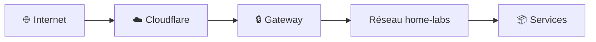

# 🌐 Infrastructure

> Composants d'infrastructure de base pour Home Labs.

## Composants

| Composant | Description | Documentation |
|-----------|-------------|---------------|
| 🔒 [Gateway](gateway/) | Cloudflare Tunnel | [README](gateway/README.md) |

## Architecture



## Démarrage

```bash
# Créer le réseau
docker network create home-labs

# Démarrer le gateway
cd gateway
cp .env.example .env
# Éditer .env
docker compose up -d
```

## 📚 Documentation

➡️ [Documentation Infrastructure](../docs/infrastructure/README.md)
