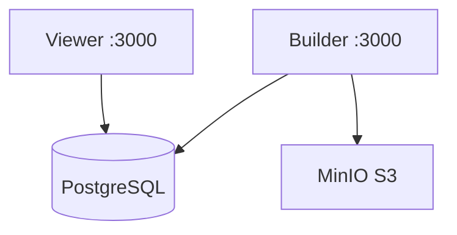

# 🤖 Typebot

> Plateforme de création de chatbots no-code.

## Vue d'Ensemble

| Propriété | Valeur |
|-----------|--------|
| **Builder** | [typebot.yanis-harrat.com](https://typebot.yanis-harrat.com) |
| **Viewer** | [bot.yanis-harrat.com](https://bot.yanis-harrat.com) |
| **S3 Console** | [s3.yanis-harrat.com](https://s3.yanis-harrat.com) |
| **Type** | Stack multi-conteneurs |

## 🏗️ Architecture



## 📦 Conteneurs

| Conteneur | Rôle |
|-----------|------|
| `typebot-builder` | Interface de construction |
| `typebot-viewer` | Exécution des bots |
| `typebot-db` | PostgreSQL 16 |
| `typebot-minio` | Stockage S3 |

## 🚀 Démarrage

```bash
# Configuration
cp .env.example .env
# Éditer .env (secrets, OAuth)

# Démarrer
docker compose up -d
```

## ⚙️ Configuration Requise

| Variable | Description |
|----------|-------------|
| `ENCRYPTION_SECRET` | Secret de chiffrement |
| `NEXTAUTH_SECRET` | Secret NextAuth |
| `GITHUB_CLIENT_ID` | OAuth GitHub |
| `GITHUB_CLIENT_SECRET` | OAuth GitHub |

### Générer les Secrets

```bash
openssl rand -base64 24
```

## 🔧 Commandes

```bash
# Démarrer
docker compose up -d

# Logs
docker compose logs -f typebot-builder typebot-viewer

# Mise à jour
docker compose pull && docker compose up -d

# Backup DB
docker exec typebot-db pg_dump -U typebot typebot > backup.sql
```

## 📚 Documentation

➡️ [Documentation complète](../../docs/services/typebot.md)
